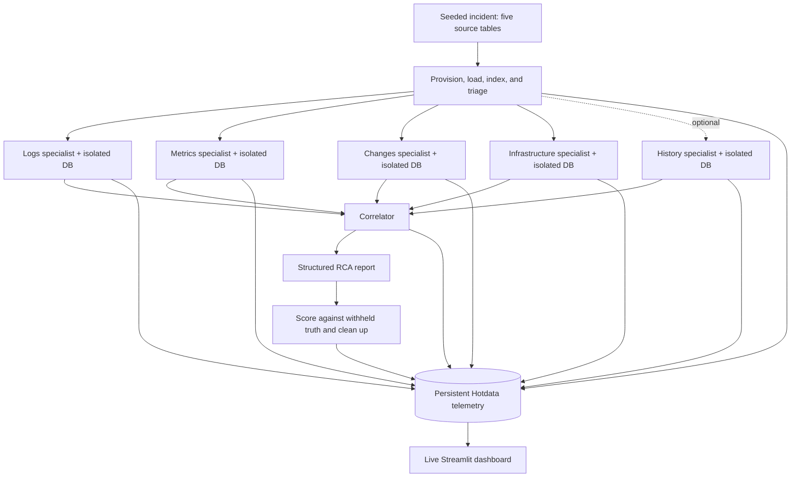

# IncidentSwarm

**Investigate one incident from multiple perspectives. Measure whether parallel agents help.**

IncidentSwarm gives specialist agents isolated databases for logs, metrics, changes,
and infrastructure events, with an optional fifth agent for past postmortems.
They investigate concurrently, then a correlator combines their evidence into a
root-cause report. A single-agent baseline and persistent telemetry make speed,
accuracy, cost, and recurring failures visible across runs.

Built for the [Data & AI Hackathon](https://luma.com/qisv9xmg), September 11, 2026,
at AWS Builder Loft in San Francisco. This implementation follows the supplied
**Parallel Agents** brief.

[Quick start](#quick-start) · [Architecture](#architecture) · [Demo](#demo) · [Benchmark](#benchmark) · [Status](#integration-status)

## What it does

- **Investigates synthetic incidents** with cascading symptoms, misleading changes,
  and six seeded fault types.
- **Isolates each specialist's data** in a temporary Hotdata database, with enforced
  query budgets and a shared, deterministic symptom summary.
- **Produces a structured RCA** with a root service, fault, trigger, onset time,
  a timeline, and ruled-out alternatives.
- **Measures every investigation** against withheld ground truth and a single-agent
  baseline, with live telemetry and downloadable reports in Streamlit.

This is an investigation and benchmarking prototype. It does not connect to a
production incident feed or execute remediation.

## Quick start

Use **Python 3.11+** and **uv**. Run commands from the repository root.

### 1. Install and verify the synthetic scenarios

```bash
uv sync --locked
uv run python -m gen.scenarios --seeds 1-12 99
uv run python -m bench.validate
uv run python -m bench.score
uv run python -m unittest discover -s tests -v
```

After dependencies are installed, generation, validation, scoring, and regression
tests run without API credentials. Seeds 1–12 cover each fault type twice; seed 99
is reserved for the demo.

### 2. Configure the live services

```bash
cp -n .env.example .env
```

Fill in `.env`:

| Variable | Purpose |
| --- | --- |
| `HOTDATA_API_KEY`, `HOTDATA_WORKSPACE` | Temporary agent databases and shared telemetry |
| `OPENAI_API_KEY` | Specialist and correlator model calls |
| `FAST_MODEL`, `STRONG_MODEL` | Investigation and synthesis model tiers |
| `MODEL_PRICING` | JSON mapping each configured model to `[input, output]` USD per million tokens |
| `TELEMETRY_DB_ID` | Persistent database ID, created in the next step |
| `HOTDATA_EMBEDDING_PROVIDER_ID` | Optional; enables the history specialist's vector index |

Existing shell environment variables override `.env`. To inspect the models
available to your key, run `uv run python -m bench.preflight --list-models`.
Set current token rates before benchmarking; an unpriced model otherwise records
zero estimated cost, and preflight rejects it.

### 3. Create telemetry storage and check connectivity

```bash
uv run python -m bench.preflight --create-telemetry-db
# Save the printed ID as TELEMETRY_DB_ID in .env, then:
uv run python -m bench.preflight
```

The telemetry database persists across runs. Preflight exercises a real
create → load → query → delete cycle and calls both configured models.
Live preflight and benchmarks consume service credits.

### 4. Run a small paired benchmark

```bash
uv run python -m bench.run_batch --mode both --version v1 --seeds 1 --concurrency 1
uv run streamlit run dashboard/app.py
```

Open **http://localhost:8501**. Refresh the dashboard to query Hotdata again.
Explore benchmark results, agent contributions, query behavior, failures, and RCA
reports. The dashboard only reads telemetry; it does not start investigations.

## Architecture



The current runner uses Python `ThreadPoolExecutor` for fan-out. Agents receive
only their own database tools and a symptom summary; they do not receive
`truth.json` or other agents' findings. The correlator sees their results after
fan-in. Temporary databases are individually deleted during teardown, with a
30-minute TTL as a crash backstop.

| Specialist | Data | Tools | Query budget |
| --- | --- | --- | ---: |
| Logs | `logs` | SQL, full-text search | 40 |
| Metrics | `metrics` | SQL | 30 |
| Changes | `changes` | SQL | 15 |
| Infrastructure | `k8s_events` | SQL, full-text search | 15 |
| History, optional | `postmortems` | Vector search | 10 |

Search indexes and SQL templates depend on the Hotdata integration. The current
full-text and vector templates require live verification; see
[API verification notes](docs/verify.md).

## Demo

1. Run both modes on the held-out scenario:
   ```bash
   uv run python -m bench.run_batch --mode both --version demo --seeds 99 --concurrency 1
   ```
2. Open **RCA reports** and show the diagnosis and its four score components.
3. Open **Benchmark** and compare `demo` with `single-demo` on speed and score.
4. Use **Agent contributions** and **Failures** to explain which sources helped
   and which calls retried or failed.

For repeated experiments, use `--seeds 1-12 --concurrency 3`. After an actual
prompt or pipeline change, run a new version such as `v2`. The version flag is a
label; it does not change the implementation. Keep model settings and scenario
data fixed when comparing versions.

## Benchmark

Each report earns up to four points:

| Component | Match rule |
| --- | --- |
| Root service | Exact match |
| Fault type | Exact match; `unknown` never matches |
| Trigger event | Exact match; null matches null |
| Onset time | Within 120 seconds of ground truth |

The baseline uses one agent over all five source tables, a 110-query budget,
and the same model tiers and correlator prompt. Both modes use the same seeded
scenarios and scoring. The validator checks that root symptoms appear before
the cascade, trigger events exist, and each scenario includes two red herrings.

**Interpret results as a comparison of two investigation designs.** Specialist
prompts, context layout, and reasoning-turn limits differ. Without an embedding
provider, parallel mode runs four specialists with a combined 100-query budget,
while the baseline still has all five tables and 110 queries. Deterministic
triage also supplies strong onset evidence to both arms. This is not a controlled
measurement of concurrency alone or evidence of production accuracy.

The dashboard computes results from recorded runs, pairs matching version tags,
and reports failed investigations separately. Cost figures estimate model token
usage from configured rates; they exclude infrastructure, warm-up probes, and
incomplete runs.

### Recorded runs

19 runs across six seeded scenarios covering all six fault types. These are
observations from this configuration, read back from the telemetry database —
they are bounded by every caveat above, and are not a controlled measurement of
concurrency.

| pipeline_version | mode | runs | avg score | avg wall (s) | avg $ | avg tokens |
| --- | --- | --- | --- | --- | --- | --- |
| `single-v1` | single | 6 | 3.50 | 190 | 0.0616 | 48,695 |
| `v1` | parallel | 6 | 4.00 | 298 | 0.1326 | 199,985 |
| `v2` | parallel | 6 | 4.00 | 222 | 0.0891 | 118,391 |

Against the four targets recorded before any run:

| ID | Metric | Target | Observed | |
| --- | --- | --- | --- | --- |
| T1 | Median wall-clock, parallel ÷ single | ≤ 0.5 | 1.17 | not met |
| T2 | Mean score (0–4), parallel − single | ≥ 0 | +0.50 | met |
| T3 | Mean $/run, v2 vs v1 | v2 < v1 at ≥ v1 score | −33% at equal score | met |
| T4 | Volume | ≥ 36 runs, ≥ 2 versions + baseline | 19 runs, 2 versions + baseline | partial |

**T1 was not met, and the gap is large rather than marginal.** In this
configuration the parallel arm was slower than the single-agent baseline, while
scoring higher (4.00 vs 3.50, winning outright on `pool_exhaustion` and
`cpu_throttle`). Wave 1 finishes only when its slowest specialist finishes, and
specialist wall-clock here is dominated by model round trips rather than query
count — so fanning out bought accuracy and source isolation, not speed. T4 missed
on volume because runs average roughly four minutes; version coverage was met.

### What the telemetry changed

One change, selected from recorded data so its effect stays attributable.

- **Observed (Q1, Q2).** The metrics specialist was the wave-1 bottleneck in 5 of
  6 runs at 231s average, the most expensive specialist in the wave at $0.049 —
  6.7× the changes specialist — and tied for the lowest hit rate at 33%. The
  changes specialist reached 50% for $0.007 across 1.8 queries.
- **Changed (v2).** Adaptive fan-out drops the metrics specialist. Its source is
  still read: wave-0 triage derives onset ordering and peak values from the
  metrics table deterministically and passes them to every specialist and to the
  correlator. It is a runtime flag (`--skip-agents metrics`), not a code fork, so
  v1 and v2 differ by one input.
- **Observed after (Q4, Q7).** Score held at 4.00. Wall 298s → 222s. Cost $0.1326
  → $0.0891. Tokens 200k → 118k. Idle specialist time 470s → 169s. The
  parallel-to-single ratio moved from 0.69× to 0.93×, still short of T1.

Removing a specialist made this configuration faster and cheaper at equal score.
That is a defensible edit only because the telemetry identified which one to
remove; it is not a general claim about specialist count.

## Integration status

| Component | Current state |
| --- | --- |
| Hotdata | Implemented: database lifecycle, queries, persistent typed telemetry |
| Python orchestration | Implemented: parallel specialists, correlator, baseline, batch runner |
| RocketRide | **Pending:** [pipeline blueprint](pipes/SPEC.md); no exported `.pipe` files or runtime integration in this repository |
| History search | Optional; needs an embedding provider and verified vector query syntax |
| Compound memory stack | Cognee, HydraDB, and Modiqo are not implemented |

The two supplied briefs describe different tracks. This project targets the
parallel-agent workflow; it does not claim to satisfy the separate compound-memory
brief. RocketRide orchestration and exported pipelines remain required work before
claiming completion of the parallel brief's sponsor integration.

## Development and troubleshooting

```text
agents/       specialist tools, prompts, schemas, lifecycle, and orchestration
bench/        preflight, scenario validation, scoring, and batch runner
gen/          deterministic incident and postmortem generators
telemetry/    event schema, buffered writes, and live SQL queries
dashboard/    Streamlit benchmark and report interface
tests/        offline regression tests
data/         generated scenarios and telemetry backlog (gitignored)
pipes/        RocketRide integration blueprint
docs/         API verification notes
```

- **No scenarios:** run the generator before preflight or benchmarking.
- **No telemetry:** create the persistent database and save its ID in `.env`.
- **No history agent:** configure `HOTDATA_EMBEDDING_PROVIDER_ID`; otherwise four
  specialists is expected.
- **Failed search calls:** inspect the failure view and verify `HOTDATA_FTS_SQL`
  or `HOTDATA_VECTOR_SQL` against the service's supported syntax.
- **Telemetry write contention:** writes are serialized per process, retried,
  then saved to `data/telemetry_backlog/` for replay at the end of a live batch.
- **Local telemetry:** `--local-telemetry` writes Parquet instead of uploading
  events. Agent databases and model calls still use live services; this is not
  an offline investigation mode and does not populate the live dashboard.

[plan.md](plan.md) preserves the original build plan and targets;
[docs/verify.md](docs/verify.md) records integration findings and remaining checks.
